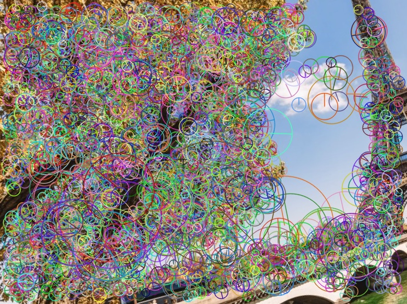
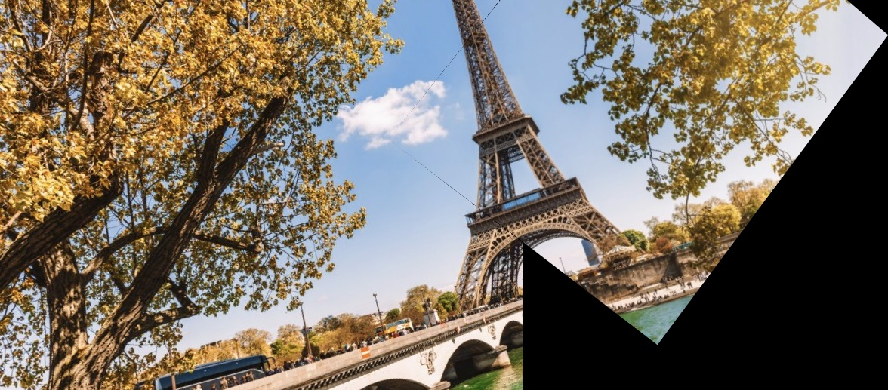

# Image stitching
(project based on OpenCV)  
1. Find ___SURF___ feature points in each images
1. Select the best 20 matches of feature points
1. Use ___RANSAC___ to to build ___Homography Matrix___ and get the transformation matrix
1. Merge the superposed parts according to the weights based on the distance from the border
1. Save the stitched image

# Assemblage d'images
(projet basé sur OpenCV)
1. Identifier des points caractéristiques ___SURF___ dans chaque image
1. Sélectionner les 20 meilleurs matchs de points caractéristiques
1. Utiliser ___RANSAC___ pour créer ___Homography Matrix___ et obtenir la matrice de transformation
1. Fusionner les parties superposées des images en fonction des poids basés sur la distance du bord
1. Enregistrer l'image cousue

## Original images | Images originales
 

## Feature points | Points caractéristiques
 

## Best 20 matches | Les meilleurs 20 matchs

## Stitched image | Image cousue
