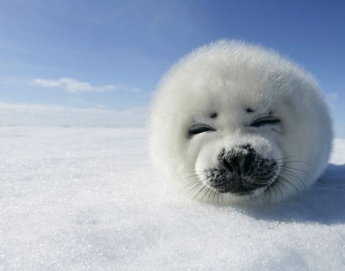

# Image stitching
(project based on OpenCV)  
1. Find ___SURF___ feature points in each images
1. Select the best 20 matches of feature points
1. Use ___RANSAC___ to to build ___Homography Matrix___ and get the transformation matrix
1. Merge the superposed parts according to the weights based on the distance from the border
1. Save the stitched image

# Assemblage d'images
(projet bas� sur OpenCV)
1. Identifier des points caract�ristiques ___SURF___ dans chaque image
1. S�lectionner les 20 meilleurs matchs de points caract�ristiques
1. Utiliser ___RANSAC___ pour cr�er ___Homography Matrix___ et obtenir la matrice de transformation
1. Fusionner les parties superpos�es des images en fonction des poids bas�s sur la distance du bord
1. Enregistrer l'image cousue

# Experiment 1
#### Original images | Images originales
 

#### Feature points | Points caract�ristiques
 

#### Best 20 matches | Les meilleurs 20 matchs

#### Stitched image | Image cousue

# Experiment 2
#### Original images | Images originales
 

#### Feature points | Points caract�ristiques
 

#### Best 20 matches | Les meilleurs 20 matchs

#### Stitched image | Image cousue
